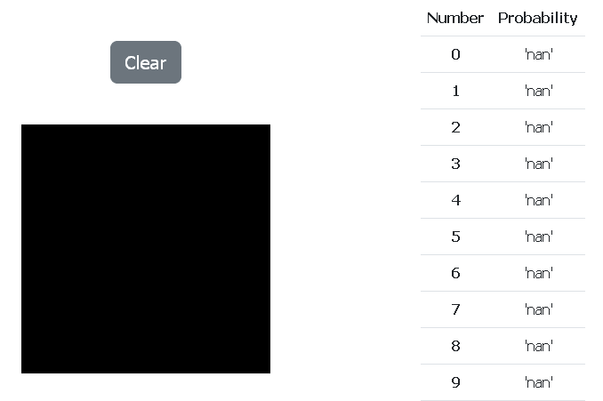

# Fast ML MVP



## Getting Started

### Installing

**Step 1.** Clone repo
```
git clone https://github.com/recode-academy/fast-ml-mvp
```

### Running

There are two ways of running app:

* Local running
* Docker running

#### Local Running

**Step 2.** Go to `fast-ml-mvp`

**Step 3.** Install requirements
```
pip install -r requirements.txt
```

Attention! PyTorch can cause errors while installing. 
See PyTorch [installation guide](https://pytorch.org/get-started/locally/).


**Step 4.** Change these params in `src/fast-ml-mvp/settings.py`

```
SECRET_KEY = '%enter_your_secret_key%'
DEBUG = True or False, what you need
ALLOWED_HOSTS = [] Make empty
CSRF_TRUSTED_ORIGINS = Delete this param
```

**Step 5.** Go to `src`

**Step 6.** Apply migrations
```
python manage.py migrate
```

**Step 7.** Run django server
```
python manage.py runserver
```

**Step 8.** Open `127.0.0.1:8000` in your browser

#### Docker Running

**Step 2.** Go to `fast-ml-mvp`

**Step 3.** Change these params in `.env`

```
DJANGO_HOST=%enter_your_host%
DJANGO_DEBUG = True or False, what you need
DJANGO_SECRET=%enter_your_secret_key%
```

**Step 3.5 (optional).** Choose app Dockerfile

Application has two dockerfiles in `docker/app`: multistage and simplified. 
By default, multistage is choosed, but if you want to change this, you have to edit `docker-compose.yml`:

```
services:
  app:
    build:
      context: .
      dockerfile: docker/app/Dockerfile_simple # <-- Add _simple postfix
  ...
```

**Step 4.** Up containers
```
docker-compose up -d
```

**Step 5.** Open ip or domain name which in `DJANGO_CSRF_TRUSTED_HOST` in your browser
