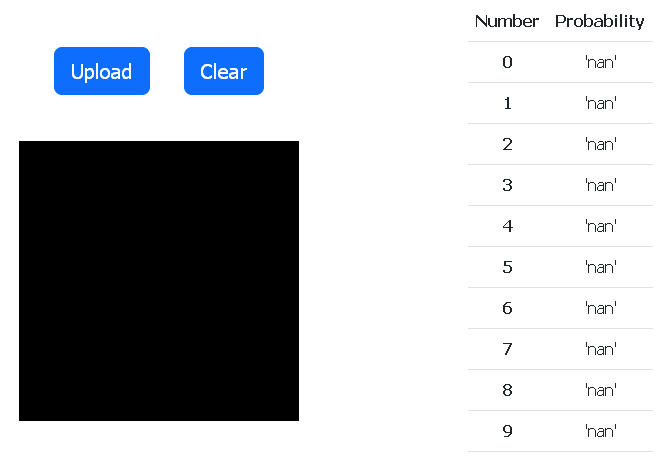

# Fast ML MVP



## Getting Started

### Installing

Step 1. Clone repo
```
git clone https://github.com/recode-academy/fast-ml-mvp
```

Step 2. Install requirements
```
pip install -r reqirements.txt
```

Attention! PyTorch can cause errors while installing. 
See PyTorch [installation guide](https://pytorch.org/get-started/locally/).

### Running

Step 3. Go to `src`
```
cd src
```

Step 4. Run django server
```
python manage.py runserver
```

### Usage

Step 5. Open `127.0.0.1:8000` in your browser